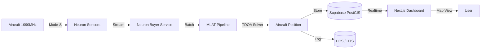

# ✈️ AircraftWorth (SynapseWorth → Neuron MLAT)

    

> **Distributed Aircraft Tracking via Multilateration.** AircraftWorth is a real-time MLAT system that consumes Mode-S data from the Neuron sensor network, calculates aircraft positions using TDOA, and notarizes every solution on Hedera with Supabase for geospatial persistence and live visualization.

## 📚 Table of Contents
1. [Architecture](#-architecture)
2. [Feature Highlights](#-feature-highlights)
3. [Repository Map](#-repository-map)
4. [Quick Start](#-quick-start)
5. [Environment Configuration](#-environment-configuration)
6. [Core Workflows](#-core-workflows)
7. [Additional Documentation](#-additional-documentation)

## 🧠 Architecture

- **Neuron Sensor Network**: Distributed Mode-S receivers with GPS timestamps and libp2p streams.
- **MLAT Solver**: Time Difference of Arrival (TDOA) algorithm using SciPy for multilateration.
- **Hedera Trust Layer**: HCS logs every MLAT solution; HTS mints Flight Track Tokens for high-confidence positions (≥90%, ≥4 sensors).
- **Supabase Geospatial DB**: PostGIS for sensor locations, TimescaleDB-style indexing for time-series Mode-S messages and aircraft positions.
- **Real-time Dashboard**: Leaflet map with live aircraft markers, sensor network visualization, and Hedera proof explorer.

## ✨ Feature Highlights
- ✈️ **Real-time aircraft tracking** via Neuron Mode-S sensor network with MLAT position calculation.
- 📍 **Geospatial precision** using PostGIS for sensor locations and aircraft position storage in Supabase.
- 🧾 **Immutable audit trail** with every MLAT solution logged to Hedera HCS including sensor IDs and confidence scores.
- 🪙 **Flight Track Tokens** minted via Hedera HTS for high-confidence positions (≥90% confidence, ≥4 sensors).
- �️ **Live dashboard** with Leaflet map showing aircraft positions, sensor network, and real-time Supabase subscriptions.
- 🔄 **Replay CLI** for testing MLAT pipeline with recorded Mode-S datasets (100% success rate on test data).
- 🛰️ **Neuron buyer service** with async queue-based message buffering and sensor discovery.

## 🗂 Repository Map
```
.
├── README.md                  # You are here 👋
├── backend/                   # FastAPI + Neuron + MLAT + Hedera + Supabase
│   ├── services/              # Neuron buyer, MLAT solver, Supabase, Hedera
│   ├── routers/               # MLAT API endpoints
│   ├── scripts/               # Sensor seeding, replay CLI, Hedera setup
│   ├── supabase/              # PostgreSQL schema with PostGIS
│   └── tests/                 # MLAT solver unit tests
├── frontend/                  # Next.js 16 MLAT dashboard with live map
│   ├── app/mlat/              # Real-time aircraft tracking page
│   ├── components/            # Aircraft map (Leaflet), navigation
│   └── lib/                   # Supabase client, type definitions
├── docs/                      # Neuron bounty PRD, improved PRD
└── SUPABASE_SETUP.md          # Database schema setup instructions
```
Refer to each subfolder README for deep dives.

## 🚀 Quick Start
> **Prereqs**: Python 3.12+, Node 20+/pnpm 9, Supabase account, Hedera testnet credentials, Neuron buyer credentials.

### 1. Backend Setup
```bash
cd backend
python -m venv .venv
source .venv/bin/activate
pip install -e .
```

### 2. Supabase Schema
1. Go to your Supabase SQL Editor
2. Copy and run `backend/supabase/schema.sql`
3. Seed sensors: `python scripts/seed_sensors.py`

### 3. Environment Configuration
Copy `backend/.env.example` to `backend/.env` and fill in:
- Hedera operator credentials (ID, private key)
- Supabase URL and keys (anon + service role)
- Neuron buyer credentials and sensor IDs

### 4. Frontend Setup
```bash
cd frontend
pnpm install
```
Create `frontend/.env.local` with Supabase credentials.

### 5. Run Services
```bash
# Backend (FastAPI + auto-reload)
cd backend
uvicorn main:app --reload --port 8000

# Frontend (Next.js dev server)
cd frontend
pnpm dev --port 3000
```

### 6. Test MLAT Pipeline
```bash
cd backend
# Generate sample data
python scripts/replay_modes.py --generate data/sample.ndjson --aircraft 3 --messages 15

# Replay through pipeline
python scripts/replay_modes.py --file data/sample.ndjson
```

Visit `http://localhost:3000/mlat` for the live aircraft tracking dashboard.

## 🔐 Environment Configuration

### Backend `.env`
```bash
# Hedera
HEDERA_OPERATOR_ID=0.0.xxxxx
HEDERA_OPERATOR_KEY=302e...
HCS_TOPIC_ID=0.0.xxxxx
SWT_TOKEN_ID=0.0.xxxxx

# Neuron
NEURON_BUYER_ACCOUNT_ID=0.0.xxxxx
NEURON_BUYER_PRIVATE_KEY=...
NEURON_SENSOR_IDS=021a29e7...,037ec65f...,030a3c71...

# Supabase
SUPABASE_URL=https://xxx.supabase.co
SUPABASE_ANON_KEY=eyJhbGc...
SUPABASE_SERVICE_ROLE_KEY=eyJhbGc...

# MLAT Config
MLAT_MIN_SENSORS=3
MLAT_CONFIDENCE_THRESHOLD=80
```

### Frontend `.env.local`
```bash
NEXT_PUBLIC_SUPABASE_URL=https://xxx.supabase.co
NEXT_PUBLIC_SUPABASE_ANON_KEY=eyJhbGc...
NEXT_PUBLIC_BACKEND_URL=http://localhost:8000
```

> **Security**: `.gitignore` protects `.env*` and `buyer-env` files. Never commit live keys.

## 🧭 Core Workflows

### MLAT Pipeline
1. **Neuron Stream Ingestion**: Buyer service connects to Neuron sensors, buffers Mode-S messages in async queue.
2. **Message Batching**: `POST /api/mlat/ingest` receives batches, stores in Supabase `mode_s_messages` table.
3. **MLAT Calculation**: Pipeline groups messages by ICAO + time window, runs TDOA solver with ≥3 sensors.
4. **Hedera Logging**: Every solution logged to HCS with sensor IDs, confidence, and metadata.
5. **Token Minting**: High-confidence positions (≥90%, ≥4 sensors) trigger Flight Track Token minting via HTS.
6. **Real-time Updates**: Supabase Realtime pushes new positions to frontend map via WebSocket.

### API Endpoints
- `POST /api/mlat/ingest` - Ingest Mode-S message batches
- `POST /api/mlat/process` - Process MLAT for specific aircraft
- `GET /api/mlat/health` - Pipeline health check

### Testing & Replay
```bash
# Generate synthetic Mode-S data
python scripts/replay_modes.py --generate data/test.ndjson --aircraft 5 --messages 20

# Replay through full pipeline
python scripts/replay_modes.py --file data/test.ndjson --batch-size 10
```

## 📄 Additional Documentation
- [`docs/NEURON_BOUNTY_PRD.md`](docs/NEURON_BOUNTY_PRD.md): Original Neuron bounty strategy and architecture.
- [`docs/improved_prd.md`](docs/improved_prd.md): Enhanced PRD with 10/10 fit roadmap and implementation plan.
- [`SUPABASE_SETUP.md`](SUPABASE_SETUP.md): Step-by-step Supabase schema setup and troubleshooting.
- [`backend/README.md`](backend/README.md): Backend specific commands, endpoints, and testing.
- [`backend/supabase/schema.sql`](backend/supabase/schema.sql): PostgreSQL schema with PostGIS extensions.

## 🏆 Neuron Bounty Alignment

**Challenge**: Build a Multilateration (MLAT) system for aircraft localization using Neuron Mode-S sensor network.

**Our Solution**:
- ✅ Neuron buyer service with async stream consumption
- ✅ MLAT solver using TDOA with SciPy optimization
- ✅ Hedera HCS logging for immutable audit trail
- ✅ Flight Track Tokens (HTS) for high-confidence positions
- ✅ Supabase PostGIS for geospatial sensor + position storage
- ✅ Real-time dashboard with Leaflet map and live updates
- ✅ Replay CLI for reproducible testing (100% success rate)
- ✅ 12 Neuron sensors seeded with location metadata

**Demo**: Visit `/mlat` dashboard for live aircraft tracking with Hedera proof explorer.

Need help? Open an issue or reach out during the hackathon. ✈️
