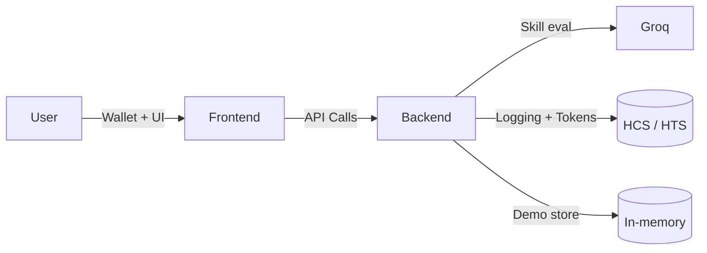

# 🌐 SynapseWorth

   

> **Verifiable Intelligence. Tokenized Potential.** SynapseWorth is an agent-native platform that evaluates, verifies, and tokenizes human knowledge using Groq for cognition and Hedera for trust, coordination, and incentives.

## 📚 Table of Contents
1. [Architecture](#-architecture)
2. [Feature Highlights](#-feature-highlights)
3. [Repository Map](#-repository-map)
4. [Quick Start](#-quick-start)
5. [Environment Configuration](#-environment-configuration)
6. [Core Workflows](#-core-workflows)
7. [Additional Documentation](#-additional-documentation)

## 🧠 Architecture

- **Groq Cognition Layer**: Multi-agent reasoning for skill evaluations, confidence scoring, and career simulations.
- **Hedera Trust Layer**: Consensus logging (HCS), token minting (HTS), and smart-contract ready abstractions.
- **In-Memory Evaluation Store**: Provides instant demo data + persistence fallback for dashboards.

## ✨ Feature Highlights
- ⚡ **Sub-second insights** powered by Groq Llama 3 models with deterministic fallback paths.
- 🧾 **Auditable decisions** logged to Hedera Consensus Service (or simulated locally for demos).
- 🪙 **Skill Worth Tokens (SWT)** minted via Hedera Token Service with graceful stubs when creds are absent.
- 🛰️ **Agent-native dashboard** featuring marketplace, publishing flows, verifications, and reputation analytics.
- 🧰 **Full test harness** (pytest + 100% coverage gate) ensuring backend reliability once credentials are available.

## 🗂 Repository Map
```
.
├── README.md                  # You are here 👋
├── backend/                   # FastAPI + Groq + Hedera services
├── frontend/                  # Next.js 16 dashboard + landing page
├── docs/                      # PRD, frontend spec, WalletConnect guides
└── .windsurf/                 # (If present) custom workflows
```
Refer to each subfolder README for deep dives.

## 🚀 Quick Start
> **Prereqs**: Python 3.12+, Node 20+/pnpm 9, Hedera + Groq credentials (or run in demo mode).

| Layer    | Command                                                                 |
|----------|--------------------------------------------------------------------------|
| Backend  | `cd backend && python -m venv .venv && source .venv/bin/activate && pip install -e .` |
| Frontend | `cd frontend && pnpm install`                                            |

Once dependencies are installed:
```bash
# Backend (FastAPI + auto-reload)
cd backend
uvicorn main:app --reload --port 8000

# Frontend (Next.js dev server)
cd frontend
pnpm dev --port 3000
```
The dashboard expects the backend at `http://localhost:8000` (configurable via `.env.local`).

## 🔐 Environment Configuration
Both layers load their own `.env` files; templates are provided:

| Location  | Template            | Notes |
|-----------|---------------------|-------|
| backend   | `backend/.env.example` | Copy to `.env` and provide Groq + Hedera secrets. Falls back to deterministic mocks if unset. |
| frontend  | `frontend/.env.example` (create if needed) | Provide `NEXT_PUBLIC_WALLETCONNECT_PROJECT_ID`, API base URL, etc. |

> **Security**: `.gitignore` protects `.env*` files. Never commit live keys.

## 🧭 Core Workflows
1. **Evaluate Profile**: Frontend form ➜ `POST /api/agent/evaluate` ➜ Groq reasoning ➜ optional Hedera logging ➜ evaluation stored for dashboards.
2. **Log Reputation**: Stored evaluations feed `/api/evaluation/{userId}` to populate dashboards even in demo mode (seed user `agent-demo`).
3. **Tokenization**: `/api/hedera/mint-skill-token` triggers HTS minting when credentials are configured; otherwise local IDs keep demo flows alive.

## 📄 Additional Documentation
- [`docs/PRD.md`](docs/PRD.md): Executive-level product requirements.
- [`docs/frontend.md`](docs/frontend.md): Design language, route requirements, and UX intent.
- [`docs/hedera-wallet.md`](docs/hedera-wallet.md): Hedera wallet setup & WalletConnect references.
- [`backend/README.md`](backend/README.md): Backend specific commands, endpoints, and testing.
- [`frontend/README.md`](frontend/README.md): Frontend design system, scripts, and integration notes.

Need help? Open an issue or reach out during the hackathon stand-ups. 🛰️
